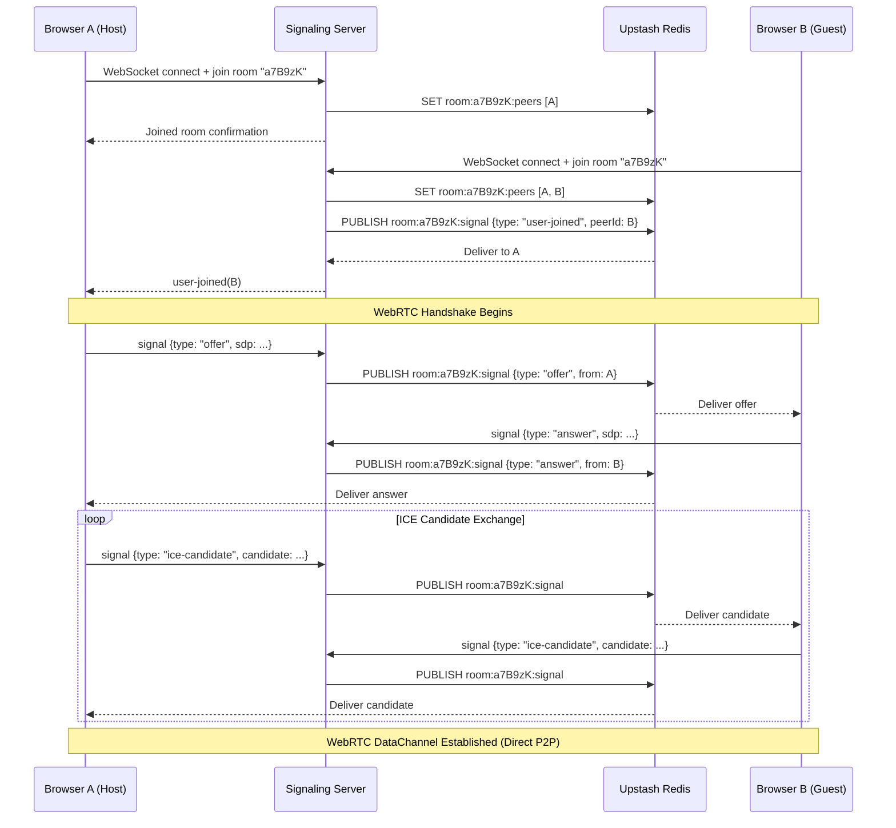
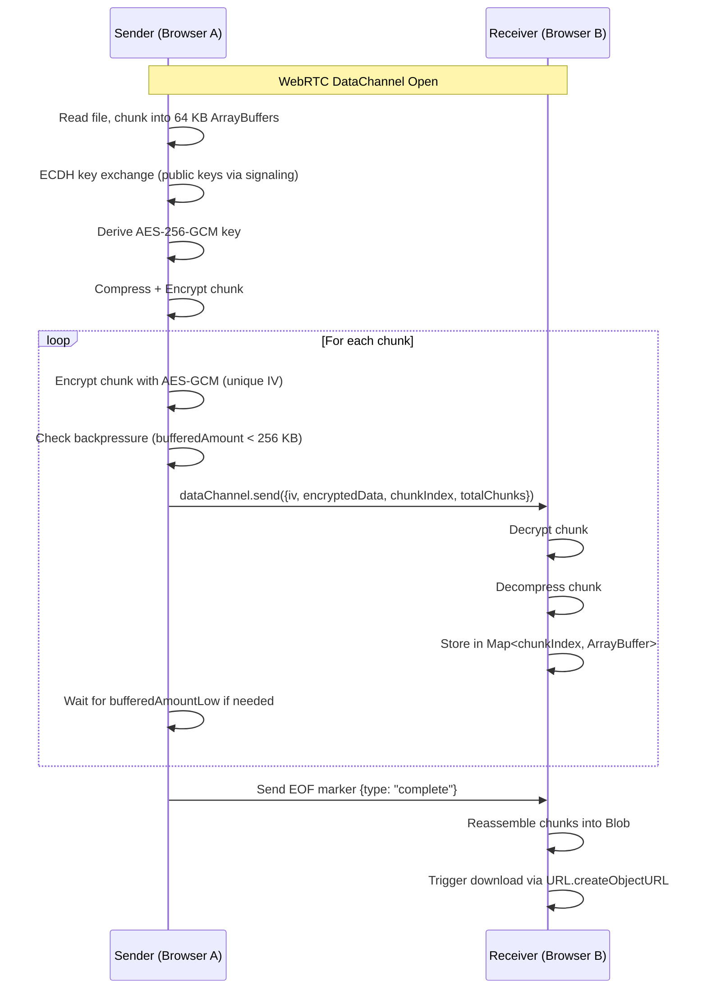

# Technical Specifications (TechSpec)
## P2P File Share — WebRTC + Next.js + Redis

**Version:** 1.0.0  
**Last Updated:** 2026-07-15  
**Status:** Draft

---

## 1. System Architecture

### 1.1 High-Level Architecture

```
┌─────────────────────────────────────────────────────────────┐
│                        Vercel (Free)                        │
│  ┌─────────────────────────────────────────────────────────┐│
│  │              Next.js 14 Frontend (App Router)           ││
│  │  ┌─────────────┐  ┌─────────────┐  ┌─────────────────┐ ││
│  │  │   Pages/    │  │ Components/ │  │    Hooks/       │ ││
│  │  │ - page.tsx  │  │ - Room.tsx  │  │ - useWebRTC.ts  │ ││
│  │  │ - room/     │  │ - Graph.tsx │  │ - useSignaling.ts│ ││
│  │  │   [code]/   │  │ - Dropzone.tsx│ │ - useEncryption.ts│ ││
│  │  └─────────────┘  └─────────────┘  └─────────────────┘ ││
│  │  ┌─────────────────────────────────────────────────────┐││
│  │  │           Zustand Store (Global State)              │││
│  │  │  - roomStore: { code, peers, files, status }        │││
│  │  └─────────────────────────────────────────────────────┘││
│  └─────────────────────────────────────────────────────────┘│
└─────────────────────────────────────────────────────────────┘
                              │
                              │ HTTPS (API calls) / WSS (WebSocket)
                              ▼
┌─────────────────────────────────────────────────────────────┐
│              Railway / Render (Free Tier)                   │
│  ┌─────────────────────────────────────────────────────────┐│
│  │              ws Signaling Server (Node.js)              ││
│  │  - Room management (create, join, leave)                ││
│  │  - SDP offer/answer relay                               ││
│  │  - ICE candidate relay                                  ││
│  │  - Peer presence tracking                               ││
│  │  - Rate limiting + input validation                     ││
│  └─────────────────────────────────────────────────────────┘│
│                            │                                │
│                            │ Redis Protocol                 │
│                            ▼                                │
│  ┌─────────────────────────────────────────────────────────┐│
│  │              Upstash Redis (Free Tier)                  ││
│  │  - Room metadata: { code, createdAt, peerCount }        ││
│  │  - Pub/Sub channels: room:{code}:signal                 ││
│  │  - Presence: peer:{id}:lastSeen                         ││
│  └─────────────────────────────────────────────────────────┘│
└─────────────────────────────────────────────────────────────┘
                              │
                              │ Direct P2P (WebRTC DataChannel)
                              ▼
                    ┌───────────────────┐
                    │   Browser A       │
                    │  - RTCPeerConnection
                    │  - RTCDataChannel
                    └───────────────────┘
                              │
                              │ Direct P2P (WebRTC DataChannel)
                              ▼
                    ┌───────────────────┐
                    │   Browser B       │
                    │  - RTCPeerConnection
                    │  - RTCDataChannel
                    └───────────────────┘
```

### 1.2 Data Flow (Signaling Phase)



### 1.3 Data Flow (File Transfer Phase)



---

## 2. Frontend Specifications

### 2.1 Tech Stack
| Package | Version | Purpose |
|---------|---------|---------|
| `next` | 14.x | React framework (App Router) |
| `react` | 18.x | UI library |
| `typescript` | 5.x | Type safety (strict mode) |
| `tailwindcss` | 3.x | Utility-first CSS |
| `zustand` | 4.x | State management |
| `framer-motion` | 11.x | UI animations |
| `gsap` | 3.x | Network graph canvas animations |
| `qrcode.react` | 3.x | QR code generation |
| `lucide-react` | 0.x | Icons |
| `js-file-download` | 0.4.x | File download utility |

### 2.2 Project Structure

```
src/
├── app/
│   ├── layout.tsx              ← Root layout (Tailwind, fonts)
│   ├── page.tsx                ← Landing page (Create Room)
│   └── room/
│       └── [code]/
│           └── page.tsx        ← Room page (WebRTC, file transfer)
├── components/
│   ├── ui/
│   │   ├── Button.tsx          ← Reusable button
│   │   ├── Card.tsx            ← Reusable card
│   │   ├── Input.tsx           ← Reusable input
│   │   ├── Modal.tsx           ← Reusable modal
│   │   └── Dropzone.tsx        ← Drag-and-drop file upload
│   ├── room/
│   │   ├── RoomHeader.tsx      ← Room code, copy, QR, leave
│   │   ├── PeerList.tsx        ← Connected peers list
│   │   ├── FileTable.tsx       ← Shared file metadata table
│   │   ├── NetworkGraph.tsx    ← GSAP SVG network visualization
│   │   └── ConnectionStatus.tsx← Connection state indicators
│   └── providers/
│       └── WebRTCProvider.tsx  ← WebRTC context provider
├── hooks/
│   ├── useWebRTC.ts            ← RTCPeerConnection management
│   ├── useSignaling.ts         ← WebSocket signaling client
│   ├── useEncryption.ts        ← ECDH + AES-GCM utilities
│   └── useFileTransfer.ts      ← Chunked read/write pipeline
├── store/
│   └── roomStore.ts            ← Zustand store for room state
├── lib/
│   ├── signaling.ts            ← WebSocket client logic
│   ├── crypto.ts               ← E2E encryption utilities
│   ├── chunker.ts              ← File chunking + reassembly
│   └── utils.ts                ← Formatting, validation helpers
├── types/
│   ├── room.ts                 ← Room, Peer, File interfaces
│   ├── signaling.ts            ← Signaling message types
│   └── webrtc.ts               ← WebRTC configuration types
└── styles/
    └── globals.css             ← Tailwind directives + custom animations
```

### 2.3 TypeScript Strict Mode Requirements

```json
// tsconfig.json
{
  "compilerOptions": {
    "target": "ES2022",
    "lib": ["dom", "dom.iterable", "esnext"],
    "allowJs": false,
    "skipLibCheck": true,
    "strict": true,                  // Enable all strict checks
    "noEmit": true,
    "esModuleInterop": true,
    "module": "esnext",
    "moduleResolution": "bundler",
    "resolveJsonModule": true,
    "isolatedModules": true,
    "jsx": "preserve",
    "incremental": true,
    "plugins": [{ "name": "next" }],
    "paths": { "@/*": ["./src/*"] },
    "noUnusedLocals": true,
    "noUnusedParameters": true,
    "noImplicitReturns": true,
    "noFallthroughCasesInSwitch": true,
    "noUncheckedIndexedAccess": true,
    "forceConsistentCasingInFileNames": true
  },
  "include": ["next-env.d.ts", "**/*.ts", "**/*.tsx"],
  "exclude": ["node_modules"]
}
```

### 2.4 Responsive Breakpoints (Tailwind)

| Breakpoint | Min Width | Target Devices |
|------------|-----------|----------------|
| `sm` | 640 px | Large phones (landscape) |
| `md` | 768 px | Tablets (portrait) |
| `lg` | 1024 px | Laptops (small desktop) |
| `xl` | 1280 px | Desktops (standard) |
| `2xl` | 1536 px | Large desktops |

**Mobile-first strategy:** Base styles for mobile, `md:` and `lg:` prefixes for larger screens.

---

## 3. Backend Specifications

### 3.1 Signaling Server

**Runtime:** Node.js 18+  
**Library:** `ws` (lightweight WebSocket)  
**Hosting:** Railway ($5 credit/month free tier) or Render  
**Protocol:** Custom JSON-based over WebSocket

#### 3.1.1 Message Schema

```typescript
// types/signaling.ts

export type SignalingMessage =
  | { type: 'join'; roomCode: string; peerId: string; displayName: string }
  | { type: 'leave'; roomCode: string; peerId: string }
  | { type: 'signal'; roomCode: string; from: string; to?: string; signal: RTCSessionDescriptionInit | RTCIceCandidateInit }
  | { type: 'user-joined'; roomCode: string; peerId: string; displayName: string }
  | { type: 'user-left'; roomCode: string; peerId: string }
  | { type: 'peers-list'; roomCode: string; peers: PeerInfo[] }
  | { type: 'error'; message: string };

export interface PeerInfo {
  peerId: string;
  displayName: string;
  connectedAt: number;
}
```

#### 3.1.2 Server Logic

```typescript
// server/signaling.ts
import { WebSocketServer, WebSocket } from 'ws';
import { Redis } from '@upstash/redis';

const wss = new WebSocketServer({ port: parseInt(process.env.PORT || '8080') });
const redis = new Redis({
  url: process.env.UPSTASH_URL!,
  token: process.env.UPSTASH_TOKEN!
});

// Room state (in-memory for fast lookup, Redis for pub/sub)
const rooms = new Map<string, Set<WebSocket>>();
const peerMeta = new Map<WebSocket, { peerId: string; roomCode: string; displayName: string }>();

wss.on('connection', (ws) => {
  ws.on('message', async (data) => {
    try {
      const msg = JSON.parse(data.toString()) as SignalingMessage;

      switch (msg.type) {
        case 'join':
          handleJoin(ws, msg);
          break;
        case 'leave':
          handleLeave(ws, msg);
          break;
        case 'signal':
          handleSignal(ws, msg);
          break;
      }
    } catch (err) {
      ws.send(JSON.stringify({ type: 'error', message: 'Invalid message format' }));
    }
  });

  ws.on('close', async () => {
    const meta = peerMeta.get(ws);
    if (meta) {
      await handleLeave(ws, { type: 'leave', roomCode: meta.roomCode, peerId: meta.peerId });
    }
  });
});

async function handleJoin(ws: WebSocket, msg: { type: 'join'; roomCode: string; peerId: string; displayName: string }) {
  const { roomCode, peerId, displayName } = msg;

  // Rate limit: max 10 joins per minute per IP
  const clientIp = getClientIp(ws);
  await redis.incr(`ratelimit:join:${clientIp}`);
  const attempts = await redis.get<number>(`ratelimit:join:${clientIp}`);
  if (attempts && attempts > 10) {
    ws.send(JSON.stringify({ type: 'error', message: 'Rate limit exceeded' }));
    ws.close();
    return;
  }

  // Add to room
  if (!rooms.has(roomCode)) {
    rooms.set(roomCode, new Set());
  }
  rooms.get(roomCode)!.add(ws);
  peerMeta.set(ws, { peerId, roomCode, displayName });

  // Update Redis
  await redis.sAdd(`room:${roomCode}:peers`, peerId);
  await redis.hSet(`peer:${peerId}`, { displayName, roomCode, joinedAt: Date.now() });
  await redis.publish(`room:${roomCode}:events`, JSON.stringify({ type: 'user-joined', peerId, displayName }));

  // Send peers list to new joiner
  const peers = await getPeersInRoom(roomCode);
  ws.send(JSON.stringify({ type: 'peers-list', roomCode, peers }));

  // Notify others
  broadcastToRoom(roomCode, { type: 'user-joined', roomCode, peerId, displayName }, ws);
}

async function handleSignal(ws: WebSocket, msg: { type: 'signal'; roomCode: string; from: string; signal: RTCSessionDescriptionInit | RTCIceCandidateInit }) {
  const meta = peerMeta.get(ws);
  if (!meta || meta.roomCode !== msg.roomCode) {
    ws.send(JSON.stringify({ type: 'error', message: 'Not in room' }));
    return;
  }

  // Relay signal via Redis pub/sub (1 publish = N subscribers = 1 command)
  await redis.publish(`room:${msg.roomCode}:signal`, JSON.stringify({
    type: 'signal',
    from: msg.from,
    signal: msg.signal
  }));
}

function broadcastToRoom(roomCode: string, message: object, exclude?: WebSocket) {
  const room = rooms.get(roomCode);
  if (!room) return;

  const data = JSON.stringify(message);
  room.forEach((peer) => {
    if (peer !== exclude && peer.readyState === WebSocket.OPEN) {
      peer.send(data);
    }
  });
}

function getClientIp(ws: WebSocket): string {
  // Extract IP from headers (Railway/Render set X-Forwarded-For)
  const forwarded = ws.upgradeReq?.headers['x-forwarded-for'];
  return typeof forwarded === 'string' ? forwarded.split(',')[0] : 'unknown';
}
```

### 3.2 Redis Schema

| Key Pattern | Type | Purpose | TTL |
|-------------|------|---------|-----|
| `room:{code}:peers` | Set | Stores peer IDs in room | 24 hours |
| `room:{code}:events` | Pub/Sub Channel | Real-time events (join/leave) | N/A |
| `room:{code}:signal` | Pub/Sub Channel | SDP/ICE signaling relay | N/A |
| `peer:{id}` | Hash | Peer metadata `{displayName, roomCode, joinedAt}` | 24 hours |
| `ratelimit:join:{ip}` | String (counter) | Join rate limiting | 1 minute |

### 3.3 TURN Server Configuration (coturn)

```bash
# Docker Compose for coturn on Render/Railway
version: '3.8'
services:
  coturn:
    image: coturn/coturn:latest
    ports:
      - "3478:3478/tcp"
      - "3478:3478/udp"
    environment:
      - TURN_USERNAME=user
      - TURN_PASSWORD=pass
      - TURN_REALM=p2p-file-share
      - TURN_LISTENING_PORT=3478
    command:
      - --listening-port=3478
      - --tls-listening-port=5349
      - --min-port=49160
      - --max-port=49200
      - --external-ip=<PUBLIC_IP>
      - --realm=p2p-file-share
      - --user=user:pass
      - --lt-cred-mech
```

---

## 4. WebRTC Specifications

### 4.1 RTCPeerConnection Configuration

```typescript
const rtcConfig: RTCConfiguration = {
  iceServers: [
    { urls: 'stun:stun.l.google.com:19302' },
    { urls: 'stun:stun1.l.google.com:19302' },
    {
      urls: 'turn:turn.p2p-file-share.com:3478',
      username: process.env.NEXT_PUBLIC_TURN_USERNAME || 'user',
      credential: process.env.NEXT_PUBLIC_TURN_PASSWORD || 'pass'
    }
  ],
  iceTransportPolicy: 'all',
  iceCandidatePoolSize: 2
};
```

### 4.2 DataChannel Configuration

```typescript
const dc = peerConnection.createDataChannel('file-transfer', {
  ordered: true,
  maxRetransmits: 30,
  maxPacketLifeTime: 30000
});

dc.binaryType = 'arraybuffer';
dc.bufferedAmountLowThreshold = 64 * 1024; // 64 KB

dc.onbufferedamountlow = () => {
  // Resume sending when buffer drains below threshold
  resumeSender();
};
```

### 4.3 State Machine

```
                    ┌──────────┐
                    │  new()   │
                    └────┬─────┘
                         ▼
                    ┌──────────┐
              ┌────►│  stable  │◄────┐
              │     └────┬─────┘     │
              │          │          │
              │          ▼          │
              │    ┌──────────┐     │
              │    │checking  │     │
              │    └────┬─────┘     │
              │         │          │
              │         ▼          │
              │    ┌──────────┐     │
              │    │completed │     │
              │    └────┬─────┘     │
              │         │          │
              │         ▼          │
              │    ┌──────────┐     │
              └────│  failed   │─────┘
                   └──────────┘
```

**Transitions:**
- `new` → `checking` (ICE gathering started)
- `checking` → `completed` (all candidates gathered and connectivity checked)
- `checking` → `connected` (selected candidate pair yields connectivity)
- `*` → `failed` (ICE connection failed, attempt TURN fallback)
- `*` → `disconnected` (ICE connection temporarily lost, attempt reconnect)
- `*` → `closed` (RTCPeerConnection.close() called)

---

## 5. Security Specifications

### 5.1 E2E Encryption

```
Key Exchange (via signaling, unencrypted):
  A generates ECDH P-384 key pair → sends public key to B
  B generates ECDH P-384 key pair → sends public key to A
  Both derive shared secret using ECDH

File Encryption (per chunk):
  AES-256-GCM with unique 12-byte IV per chunk
  Key derived from ECDH shared secret via HKDF-SHA256
```

### 5.2 Input Validation

| Input | Validation Rule |
|-------|-----------------|
| Room code | `/^[A-Za-z0-9]{6}$/` (6 alphanumeric chars) |
| Display name | 2–20 characters, no HTML/JS, trimmed |
| File size | Max 2 GB (2 * 1024 * 1024 * 1024 bytes) |
| MIME type | Allowlist: `image/*`, `video/*`, `audio/*`, `application/pdf`, `application/zip`, `text/*`, `application/msword`, `application/vnd.openxmlformats-officedocument.wordprocessingml.document` |
| Signaling messages | JSON schema validation, max 1 KB per message |

### 5.3 Rate Limiting

| Endpoint / Action | Limit | Window |
|-------------------|-------|--------|
| Room creation | 5 | Per IP per hour |
| Room join | 10 | Per IP per minute |
| Signaling messages | 100 | Per WebSocket connection per minute |

---

## 6. Performance Specifications

| Metric | Target | Notes |
|--------|--------|-------|
| Chunk size | 64 KB | Safe for all browsers, minimal overhead |
| Max buffered amount | 256 KB | Prevents DataChannel buffer bloat |
| Max peers per room | 6 | Full-mesh limit: N*(N-1)/2 connections |
| Max concurrent transfers per peer | 2 | Prevents resource exhaustion |
| Connection timeout | 15 seconds | Abort if ICE gathering exceeds timeout |
| Idle connection timeout | 5 minutes | Close DataChannel if no data for 5 min |
| Memory usage (1 GB transfer) | < 100 MB | Measured via Chrome DevTools heap snapshot |
| Bundle size (initial) | < 250 KB gzipped | Use dynamic imports for GSAP, QR code |

---

## 7. Error Handling Strategy

| Error Scenario | Handling |
|----------------|----------|
| WebSocket disconnect | Auto-reconnect with exponential backoff (max 3 retries) |
| RTCPeerConnection failed | Attempt restart, notify user, suggest TURN server |
| DataChannel buffer overflow | Implement backpressure, pause chunk reader |
| File read error | Catch FileReader errors, show user-friendly message |
| Encryption error | Log to console, alert user, abort transfer |
| Signaling message invalid | Send error response, close WebSocket if repeated |
| Redis connection lost | Fallback to in-memory signaling (single-server mode) |

---

## 8. Browser Compatibility

| Browser | Version | WebRTC Support | Notes |
|---------|---------|----------------|-------|
| Chrome | 80+ | Full | Primary development target |
| Firefox | 80+ | Full | Test `CompressionStream` fallback |
| Safari | 14.1+ | Full | Test iOS Safari, watch for `sdpSemantics` quirks |
| Edge | 80+ | Full | Chromium-based, same as Chrome |
| Opera | 67+ | Full | Chromium-based |

---

## 9. CI/CD Pipeline

```yaml
# .github/workflows/ci.yml
name: CI

on: [push, pull_request]

jobs:
  lint:
    runs-on: ubuntu-latest
    steps:
      - uses: actions/checkout@v4
      - uses: actions/setup-node@v4
        with: { node-version: 20 }
      - run: npm ci
      - run: npm run lint
      - run: npm run typecheck

  test:
    runs-on: ubuntu-latest
    steps:
      - uses: actions/checkout@v4
      - uses: actions/setup-node@v4
        with: { node-version: 20 }
      - run: npm ci
      - run: npm run test -- --coverage

  build:
    runs-on: ubuntu-latest
    steps:
      - uses: actions/checkout@v4
      - uses: actions/setup-node@v4
        with: { node-version: 20 }
      - run: npm ci
      - run: npm run build
```

---

## 10. Environment Variables

```env
# Frontend (.env.local)
NEXT_PUBLIC_WS_URL=wss://your-signaling-server.railway.app
NEXT_PUBLIC_TURN_URL=turn:turn.p2p-file-share.com:3478
NEXT_PUBLIC_TURN_USERNAME=user
NEXT_PUBLIC_TURN_PASSWORD=pass

# Signaling Server (.env)
PORT=8080
UPSTASH_URL=https://your-redis.upstash.io
UPSTASH_TOKEN=your-token
TURN_USERNAME=user
TURN_PASSWORD=pass
```

---

## 11. API Specifications

### 11.1 WebSocket Messages (Client → Server)

| Message | Payload | Description |
|---------|---------|-------------|
| `join` | `{ roomCode, peerId, displayName }` | Join a room |
| `leave` | `{ roomCode, peerId }` | Leave a room |
| `signal` | `{ roomCode, from, to?, signal }` | Relay SDP/ICE |

### 11.2 WebSocket Messages (Server → Client)

| Message | Payload | Description |
|---------|---------|-------------|
| `peers-list` | `{ roomCode, peers }` | List of peers in room |
| `user-joined` | `{ roomCode, peerId, displayName }` | New peer joined |
| `user-left` | `{ roomCode, peerId }` | Peer left |
| `signal` | `{ from, signal }` | SDP/ICE from remote peer |
| `error` | `{ message }` | Error notification |

---

## 12. Monitoring & Logging

| Tool | Purpose | Cost |
|------|---------|------|
| Vercel Analytics | Frontend performance | Free |
| Railway Metrics | Signaling server CPU/RAM | Free |
| Upstash Redis Metrics | Command count, memory | Free |
| Sentry (optional) | Error tracking | Free tier (5k errors/month) |
