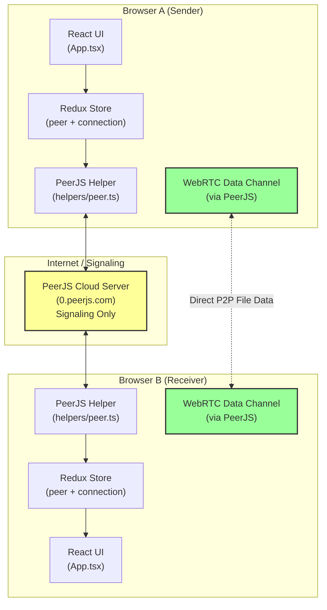
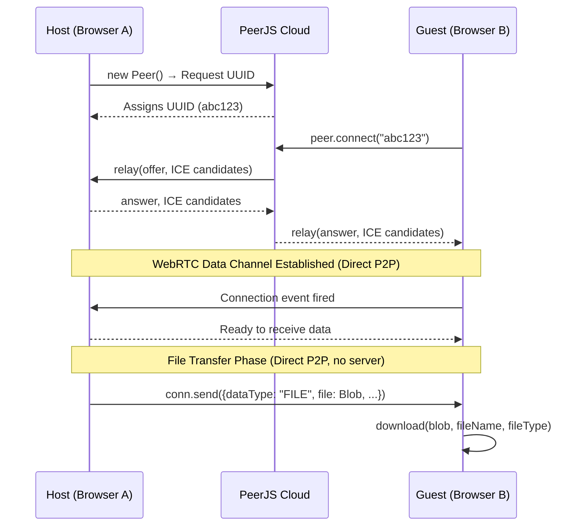
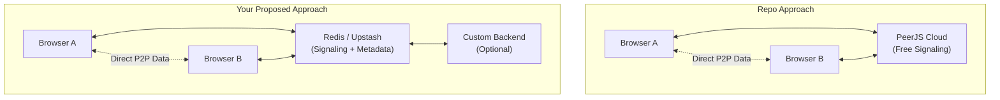

# P2P File Transfer Repository Analysis

## 1. Repository Overview

**Repo:** `p2p-file-transfer-main`
**Author:** chidokun
**Tech Stack:** TypeScript, React.js, Redux Toolkit, PeerJS, Ant Design

This is a browser-based Peer-to-Peer (P2P) file sharing application. It enables two browsers to exchange files directly without a central server storing the files. However, it does rely on a third-party **signaling server** (provided by PeerJS cloud) to establish the initial WebRTC connection.

---

## 2. Core Technologies Explained

### 2.1 PeerJS — The WebRTC Wrapper

**PeerJS** is a JavaScript library that wraps the native **WebRTC API** and provides a simpler, promise-based interface. It handles the complexity of:

- SDP offer/answer negotiation
- ICE candidate gathering
- NAT traversal (STUN/TURN)
- Connection state management

PeerJS operates on top of **WebRTC**, meaning the actual file data travels directly between browsers via the WebRTC data channel. PeerJS just makes the WebRTC setup easier.

### 2.2 Signaling in PeerJS

WebRTC requires a **signaling mechanism** to exchange connection metadata (SDP offers, answers, and ICE candidates) between peers before the direct P2P connection can be established.

PeerJS provides a **free cloud signaling server** at `0.peerjs.com` by default. This server does NOT store or relay file data. It only acts as a rendezvous point during connection setup.

### 2.3 Redux Toolkit — State Management

Redux manages the application's state:
- **Peer State:** Stores the local peer ID, loading status, and whether the session is active.
- **Connection State:** Stores the list of connected peers, selected connection, and connection loading status.

### 2.4 js-file-download

A tiny utility that triggers a browser download of a `Blob` object. Used when receiving files over the data channel.

---

## 3. Architecture Diagram



### Key Insight
- **S** (PeerJS Cloud) is only used during **connection setup**. Once connected, file data flows directly between A4 and B4.
- There is **no Redis, no database, and no custom backend** in this repo.

---

## 4. Directory Structure

```
p2p-file-transfer-main/
├── public/
│   ├── index.html
│   └── manifest.json
├── src/
│   ├── helpers/
│   │   ├── peer.ts            ← Core PeerJS wrapper (signaling + data channel)
│   │   ├── hooks.ts           ← Custom async state hook
│   │   └── runtimeConfig.ts   ← Runtime config interface (unused)
│   ├── store/
│   │   ├── index.ts           ← Redux store configuration
│   │   ├── hooks.ts           ← Typed Redux hooks
│   │   ├── peer/
│   │   │   ├── peerActions.ts ← Redux actions for peer session
│   │   │   ├── peerReducer.ts ← Redux reducer for peer state
│   │   │   └── peerTypes.ts   ← Action types & state interfaces
│   │   └── connection/
│   │       ├── connectionActions.ts ← Redux actions for connections
│   │       ├── connectionReducer.ts ← Redux reducer for connection state
│   │       └── connectionTypes.ts   ← Action types & state interfaces
│   ├── App.tsx                ← Main UI component
│   └── index.tsx              ← Entry point
├── package.json
└── README.md
```

---

## 5. Step-by-Step Workflow

### Phase 1: Session Initialization (Host)

```
┌─────────┐     Click "Start"      ┌─────────┐    new Peer()    ┌──────────────┐
│ Browser │ ──────────────────────> │ Redux  │ ──────────────> │ PeerJS Cloud │
│   A     │   dispatch(startPeer)  │ Store  │   Request ID   │  (Signaling) │
│ (Host)  │ <────────────────────── │  (A)   │ <────────────── │              │
└─────────┘   My ID = "abc123"     └────────┘   Assigns ID   └──────────────┘
```

1. **User A** clicks **Start** in `App.tsx:35`.
2. `startPeer()` Redux thunk dispatches `setLoading(true)`.
3. `PeerConnection.startPeerSession()` calls `new Peer()` (`helpers/peer.ts:24`).
4. PeerJS contacts the cloud server and gets assigned a unique UUID (e.g., `abc123`).
5. The ID is stored in Redux and displayed in the UI.
6. `PeerConnection.onIncomingConnection()` registers a listener for any incoming connections (`helpers/peer.ts:90`).

### Phase 2: Connection Establishment (Peer B Connects to Host)

```
┌─────────┐  Enter ID "abc123"   ┌─────────┐   peer.connect()   ┌──────────────┐
│ Browser │ ─────────────────────> │ Redux  │ ────────────────> │ PeerJS Cloud │
│   B     │ dispatch(connectPeer) │ Store  │   SDP Offer       │  (Signaling) │
│ (Guest) │ <──────────────────── │  (B)   │   ICE Candidates  │              │
└────────┘                       └────────┘ <────────────────  └──────────────┘
                                                                   │
                                            SDP Answer / ICE     │
                                            Candidates relayed   │
                                                                   ▼
                                          ┌────────────────────────────┐
                                          │  WebRTC Direct Connection  │
                                          │  Browser A  ←──────────→  │
                                          │  Browser B                │
                                          └────────────────────────────┘
```

1. **User B** enters Host's ID and clicks **Connect** (`App.tsx:44`).
2. `connectPeer(id)` Redux thunk calls `PeerConnection.connectPeer(id)` (`helpers/peer.ts:49`).
3. PeerJS sends an SDP offer and ICE candidates to the cloud server.
4. The cloud server relays this to **User A**.
5. **User A's** `on('connection')` listener fires (`helpers/peer.ts:91`).
6. PeerJS on both sides performs SDP/ICE negotiation.
7. A direct WebRTC data channel is established between A and B.
8. The connection is added to Redux state.

### Phase 3: File Sending

```
┌─────────┐  Select File    ┌─────────┐  sendConnection()  ┌──────────────┐
│ Browser │ ───────────────> │ Redux  │ ─────────────────> │ WebRTC Data  │
│   A     │  handleUpload()  │ Store  │  conn.send({       │  Channel     │
│ (Sender)│                   │  (A)   │    dataType: FILE, │ (Direct P2P) │
└────────┘                   └────────┘    file: Blob, ... })│              │
                                                          ──> └──────────────┘
                                                                     │
                                                                     │ Direct P2P
                                                                     │
                                                                     ▼
                                                              ┌──────────────┐
                                                              │ js-file-     │
                                                              │ download()   │
                                                              └──────────────┘
```

1. **User A** selects a file via the Upload component (`App.tsx:124`).
2. Clicking **Send** triggers `handleUpload()` (`App.tsx:51`).
3. The file is wrapped in a `Blob` and sent via `PeerConnection.sendConnection()` (`helpers/peer.ts:113`).
4. The data object contains:
   - `dataType: 'FILE'`
   - `file: Blob`
   - `fileName: string`
   - `fileType: string`
5. PeerJS serializes the data and transmits it over the WebRTC data channel.
6. **User B's** `on('data')` listener receives the data (`helpers/peer.ts:136`).
7. `js-file-download` triggers the browser to save the file (`connectionActions.ts:38`).

---

## 6. Data Flow Diagram



---

## 7. State Management Flow (Redux)

```mermaid
graph LR
    subgraph "Peer Slice"
        PA[peerActions.ts] --> PR[peerReducer.ts]
        PR --> PS[PeerState<br/>{id, loading, started}]
    end

    subgraph "Connection Slice"
        CA[connectionActions.ts] --> CR[connectionReducer.ts]
        CR --> CS[ConnectionState<br/>{id, loading, list, selectedId}]
    end

    UI[App.tsx] --> PA
    UI --> CA
    PS --> UI
    CS --> UI
    Helper[helpers/peer.ts] -.->|"calls directly"| PA
    Helper -.->|"calls directly"| CA
```

---

## 8. Code-Level Flow

### `helpers/peer.ts` — The Core Engine

| Function | Purpose | WebRTC Equivalent |
|----------|---------|-------------------|
| `startPeerSession()` | Creates a new Peer, gets UUID from cloud | RTCPeerConnection creation + signaling |
| `connectPeer(id)` | Connects to remote peer by UUID | createOffer / setLocalDescription / signaling |
| `onIncomingConnection(cb)` | Registers listener for incoming connections | ontrack / onconnectionstatechange |
| `onConnectionReceiveData(id, cb)` | Registers listener for incoming data | ondatachannel onmessage |
| `sendConnection(id, data)` | Sends data to a connected peer | dataChannel.send() |
| `closePeerSession()` | Destroys the peer and all connections | close() all RTCPeerConnections |

### Data Serialization

When a file is sent, it is wrapped in a plain JavaScript object:

```typescript
{
    dataType: 'FILE',
    file: Blob,
    fileName: string,
    fileType: string
}
```

This object is serialized by PeerJS and sent over the WebRTC data channel. On the receiving end, it is cast back to the `Data` interface.

---

## 9. Comparison: Repo Approach vs. Your Approach (WebRTC + Redis + Upstash)

### Repo's Approach

| Aspect | Implementation |
|--------|---------------|
| **P2P Transport** | WebRTC (via PeerJS library) |
| **Signaling** | PeerJS Free Cloud Server (`0.peerjs.com`) |
| **State Management** | Redux Toolkit (client-side only) |
| **Database / Storage** | None. Files never touch a server. |
| **Authentication** | None. No login required. |
| **Backend** | None. Completely serverless for file data. |

### Your Proposed Approach (WebRTC + Redis + Upstash)

| Aspect | Your Proposed Implementation |
|--------|------------------------------|
| **P2P Transport** | WebRTC (native or wrapper) |
| **Signaling** | Custom signaling server (likely using Redis pub/sub or WebSocket) |
| **State Management** | Redis (in-memory key-value store) |
| **Database / Storage** | Redis + possibly Upstash (managed Redis) for metadata |
| **Authentication** | Potentially user accounts via Redis |
| **Backend** | Custom backend for signaling and metadata management |

### Key Differences



### Detailed Comparison Table

| Feature | Repo (PeerJS) | Your Approach (WebRTC + Redis + Upstash) |
|---------|--------------|------------------------------------------|
| **Signaling Server** | Free, hosted by PeerJS | Self-hosted or managed (Upstash Redis) |
| **Cost** | $0 (free tier) | Upstash Redis has free tier, then pay-as-you-go |
| **Scalability** | Limited by PeerJS cloud capacity | High — Redis scales horizontally |
| **Control** | Low — dependent on PeerJS availability | Full control over signaling logic |
| **Complexity** | Low — zero backend setup | Medium — requires backend + Redis setup |
| **Reliability** | Medium — free tier may have limits | High — managed Redis with SLA |
| **File Size Limits** | Limited by WebRTC data channel (~256KB–16MB depending on browser/fragmentation) | Same WebRTC limits, but Redis can manage chunked transfer metadata |
| **Multi-peer Support** | Limited (mesh topology, each peer connects to all) | Better — Redis pub/sub can manage room-based multi-peer |
| **Offline / Resume** | No — connection lost = transfer failed | Possible — Redis can store transfer state |
| **User Management** | None | Possible — Redis can store user profiles |

### When to Use Which?

**Use the Repo's Approach when:**
- You want a quick prototype or demo
- You need simple 1-to-1 file sharing
- You don't want to maintain any backend
- Cost is a primary concern (free tier is sufficient)

**Use Your Approach (WebRTC + Redis + Upstash) when:**
- You need **multi-user** file sharing (rooms, groups)
- You want to track transfer history or user activity
- You need **chunked large file transfers** with resume capability
- You need **authentication** and user accounts
- You need **higher reliability** and don't want to depend on PeerJS cloud
- You plan to scale beyond a few concurrent users

---

## 10. Limitations of the Repo

1. **No Chunking:** Large files are sent as a single Blob. WebRTC data channels have message size limits (typically 16KB–64KB per message depending on `maxMessageSize`). Very large files may fail or cause browser memory issues.

2. **No Progress Tracking:** The sender doesn't track send progress, and the receiver doesn't track download progress.

3. **No Error Recovery:** If the connection drops mid-transfer, the file must be re-sent entirely.

4. **1-to-1 Only:** The architecture supports only direct 1-to-1 connections. There is no mesh or SFU for multi-peer broadcasting.

5. **No Authentication:** Anyone with the peer ID can connect. There is no password or user verification.

6. **Signaling Dependency:** If the PeerJS cloud server is down or rate-limits connections, new peers cannot establish connections.

7. **No Room / Group Concept:** Each connection is manually established by exchanging peer IDs.

---

## 11. Summary

This repository demonstrates a **minimal, dependency-free (backend-wise) P2P file transfer** using:

- **PeerJS** as a WebRTC abstraction layer
- **PeerJS Cloud** as a free signaling server
- **Redux Toolkit** for client-side state
- **Ant Design** for a clean UI

Your proposed approach using **WebRTC + Redis + Upstash** would be an **evolution** of this concept, adding:
- Custom, controllable signaling
- Metadata persistence
- Potential for multi-peer rooms
- Better scalability and reliability

However, you are still using **WebRTC** under the hood — PeerJS is just a convenience wrapper around WebRTC. The fundamental P2P data transfer mechanism is the same.
