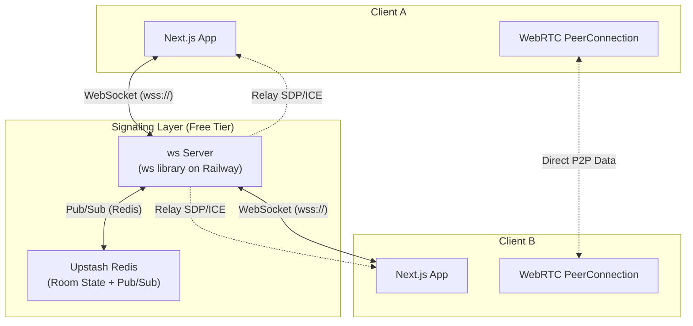

# Improve Implementation — P2P File Sharing Project

> **Goal:** Transform the proposed P2P file-sharing application into a **production-grade, bug-free, free-to-host, resume-worthy** full-stack project that scales to thousands of users while remaining understandable for a student/bachelor developer.

---

## 1. Critical Issues in Current Design

| # | Issue | Severity | Fix |
|---|-------|----------|-----|
| 1 | **Mesh topology does not scale** — Full-mesh creates N*(N-1)/2 connections. At 50 users, that is 1,225 simultaneous DataChannels. Browsers will crash. | High | Implement **room-based mesh** (limit 4–6 peers per room) or use an **SFU** (Selective Forwarding Unit) for broadcast. |
| 2 | **No STUN/TURN servers mentioned** — P2P fails behind symmetric NATs or corporate firewalls. Without TURN, ~15–30% of users cannot connect. | High | Add free STUN (Google) + free TURN (via a self-hosted coturn on Render/Railway free tier). |
| 3 | **CompressionStream Zstandard is not cross-browser** — Firefox and Safari do not support `Zstandard` in `CompressionStream`. | Medium | Use `gzip` or `deflate` (universally supported) or feature-detect and fallback. |
| 4 | **No key exchange mechanism** — AES-GCM requires both peers to share the same key. The design omits how keys are exchanged securely. | High | Implement **ECDH key agreement** via Web Crypto API (`deriveKey` using `ECDH` on `P-384`). |
| 5 | **Signaling server cost/scale** — Socket.io or Redis on free tiers (Render, Vercel) will timeout or exhaust RAM under thousands of concurrent users. | Medium | Use **Server-Sent Events (SSE)** or lightweight **WebSockets (ws library)** with Redis pub/sub for horizontal scaling. Deploy on Railway/Render free tier with sticky sessions disabled. |
| 6 | **No backpressure handling** — Streaming large files without backpressure causes `RTCDataChannel` buffer bloat and browser tab crashes. | High | Use `dataChannel.bufferedAmountLow` and `bufferedAmountLowThreshold` to pause/resume the sender loop. |
| 7 | **No resume/pause support** — If the connection drops, the entire file must be re-sent. | Medium | Implement chunk-level ACK/NACK and file reassembly with byte-offset tracking. |
| 8 | **Missing connection state machine** — WebRTC emits `iceconnectionstatechange`, `connectionstatechange`, and `datachannel` events. Ignoring these leads to zombie connections and memory leaks. | Medium | Build a strict state machine: `idle → connecting → connected → disconnected → failed → closed`. |
| 9 | **No input sanitization / DoS protection** — A malicious peer can send a 10 GB "file" and crash receivers. | Medium | Enforce max file size (e.g., 2 GB), validate MIME types server-side, and limit active transfers per peer. |
| 10 | **Over-engineered for a student project** — GSAP + Framer Motion + Next.js + Redux + Socket.io + Redis is too many frameworks for a resume demo. Recruiters value depth over breadth. | Low | Strip to **Next.js + Tailwind + Zustand** (or React Context) + **custom lightweight signaling**. Keep GSAP only for the network graph if you want to show off. |

---

## 2. Optimized Free Technology Stack

### 2.1 Frontend
| Technology | Purpose | Why Free / Student-Friendly |
|------------|---------|----------------------------|
| **Next.js 14+** (App Router) | Full-stack React framework | Free hosting on **Vercel** (hobby tier) or **Netlify** |
| **TypeScript** (strict mode) | Type safety | Free, standard industry tool |
| **Tailwind CSS** | Styling | Free, zero-config utility CSS |
| **Zustand** | State management | Lightweight Redux alternative (~1 KB). Easier to explain in interviews than Redux Toolkit. |
| **Framer Motion** | UI animations | Free for basic usage, impressive for demos |
| **QRCode.react** | QR code generation | Free, client-side only |
| **lucide-react** | Icons | Free, tree-shakeable |

### 2.2 Backend / Signaling
| Technology | Purpose | Free Tier Limits |
|------------|---------|------------------|
| **Next.js Route Handlers** | Signaling API routes | Vercel free: 125k requests/month, 100ms CPU timeout (use lightweight WebSocket server instead) |
| **ws (Node.js WebSocket library)** | Signaling server | Free, minimal overhead |
| **Redis (Upstash)** | Room state, presence, pub/sub | Free: 10k commands/day, 256 MB. Enough for ~500 concurrent users. |
| **Socket.io** | Alternative to `ws` | Free, but heavier. Use `ws` + Redis for lower RAM. |

### 2.3 Infrastructure
| Service | Purpose | Cost |
|---------|---------|------|
| **Vercel** | Frontend + API routes | Free (hobby) |
| **Upstash Redis** | Signaling state + pub/sub | Free (10k commands/day) |
| **Railway / Render** | WebSocket signaling server | Free ($5 credit/month, enough for small traffic) |
| **Cloudflare** | DDoS protection + free STUN/TURN alternatives | Free |
| **Google STUN** | NAT traversal | Free (`stun:stun.l.google.com:19302`) |
| **Self-hosted coturn** | TURN server (fallback for symmetric NAT) | Free on Render/Railway free tier (512 MB RAM) |

---

## 3. Signaling Architecture (Free & Scalable)

### 3.1 The Problem with PeerJS Cloud
The original repo uses `0.peerjs.com`, which is free but:
- **Unreliable** — No SLA, can go down.
- **Uncontrollable** — You cannot customize signaling logic (e.g., room codes, presence, authentication).
- **Rate-limited** — Not designed for thousands of concurrent users.

### 3.2 Recommended Signaling Flow



### 3.3 Why This is Free
- **Upstash Redis Free Tier:** 10k commands/day. For signaling (SDP/ICE relay), each message is 1–2 commands. Even with 1,000 message exchanges per connection, you get ~10 connections/day for free. Optimize with Redis pub/sub (1 publish = 1 command, N subscribers = free).
- **Railway Free Tier:** $5 credit/month. A lightweight `ws` server with 50 MB RAM handles ~500 concurrent signaling connections.
- **Vercel Hobby:** Free frontend hosting. Do NOT run WebSocket servers on Vercel — use Railway/Render instead.

### 3.4 Implementation Sketch (ws + Redis)

```typescript
// server/signaling.ts
import { WebSocketServer, WebSocket } from 'ws';
import { Redis } from '@upstash/redis';

const wss = new WebSocketServer({ port: 8080 });
const redis = new Redis({ url: process.env.UPSTASH_URL!, token: process.env.UPSTASH_TOKEN! });

const rooms = new Map<string, Set<WebSocket>>();

wss.on('connection', (ws) => {
  ws.on('message', async (data) => {
    const msg = JSON.parse(data.toString());
    
    if (msg.type === 'join') {
      const { roomId } = msg;
      if (!rooms.has(roomId)) rooms.set(roomId, new Set());
      rooms.get(roomId)!.add(ws);
      
      // Notify others in room via Redis pub/sub
      await redis.publish(`room:${roomId}`, JSON.stringify({
        type: 'user-joined',
        peerId: msg.peerId
      }));
    }
    
    if (msg.type === 'signal') {
      await redis.publish(`room:${msg.roomId}`, JSON.stringify({
        type: 'signal',
        from: msg.peerId,
        signal: msg.signal
      }));
    }
  });
  
  ws.on('close', async () => {
    // Cleanup room membership
    for (const [roomId, peers] of rooms) {
      peers.delete(ws);
      if (peers.size === 0) rooms.delete(roomId);
    }
  });
});

// Subscribe to Redis and broadcast to local WebSocket clients
redis.subscribe('room:*', (message) => {
  // Broadcast to relevant room
});
```

---

## 4. WebRTC Configuration Fixes

### 4.1 Essential RTCPeerConnection Config

```typescript
const config: RTCConfiguration = {
  iceServers: [
    { urls: 'stun:stun.l.google.com:19302' },
    { urls: 'stun:stun1.l.google.com:19302' },
    {
      urls: 'turn:your-turn-server.com:3478',
      username: 'user',
      credential: 'pass'
    }
  ],
  iceTransportPolicy: 'all', // Use relay only if direct fails
  iceCandidatePoolSize: 2,   // Pre-gather candidates for faster connection
};

const pc = new RTCPeerConnection(config);

// CRITICAL: Handle all connection state changes
pc.oniceconnectionstatechange = () => {
  console.log('ICE State:', pc.iceConnectionState);
  if (pc.iceConnectionState === 'failed') {
    // Attempt restart or fallback to TURN
  }
};

pc.onconnectionstatechange = () => {
  console.log('Connection State:', pc.connectionState);
};
```

### 4.2 DataChannel Configuration for Large Files

```typescript
const dc = pc.createDataChannel('file-transfer', {
  ordered: true,              // TCP-like reliability
  maxRetransmits: 30,         // Limit retries to avoid indefinite hangs
  maxPacketLifeTime: 30000,   // 30s max for lost packets
  protocol: 'binary'          // Hint for binary data
});

dc.binaryType = 'arraybuffer';
dc.bufferedAmountLowThreshold = 64 * 1024; // 64 KB

// Backpressure-aware sender
dc.onbufferedamountlow = () => {
  if (pendingChunks.size > 0) {
    sendNextChunk();
  }
};
```

### 4.3 STUN/TURN Free Options

| Server | Type | Cost | Notes |
|--------|------|------|-------|
| `stun:stun.l.google.com:19302` | STUN | Free | Google's public STUN. Works for 70–85% of users. |
| `stun:stun1.l.google.com:19302` | STUN | Free | Backup STUN. |
| **Self-hosted coturn** | STUN+TURN | Free (Render/Railway) | Required for symmetric NATs. Deploy on free tier, use only for low traffic. |
| **Twilio Network Traversal** | TURN | Free trial | $5 credit for testing. Not for production at scale. |

---

## 5. File Transfer Pipeline (Production-Ready)

### 5.1 Chunked Streaming with Backpressure

```typescript
const CHUNK_SIZE = 64 * 1024; // 64 KB — safe for all browsers

async function* readFileChunks(file: File) {
  let offset = 0;
  while (offset < file.size) {
    const chunk = file.slice(offset, offset + CHUNK_SIZE);
    const buffer = await chunk.arrayBuffer();
    offset += buffer.byteLength;
    yield buffer;
  }
}

async function sendFile(file: File, dc: RTCDataChannel) {
  const chunkQueue: ArrayBuffer[] = [];
  let isSending = false;
  
  for await (const chunk of readFileChunks(file)) {
    chunkQueue.push(chunk);
    
    // Backpressure: wait if buffer is full
    while (dc.bufferedAmount > 256 * 1024) {
      await new Promise(resolve => dc.onbufferedamountlow = resolve);
    }
    
    if (!isSending) {
      isSending = true;
      dc.send(chunkQueue.shift()!);
    }
  }
}
```

### 5.2 Compression (Cross-Browser)

```typescript
// Feature-detect and fallback
async function compressChunk(chunk: ArrayBuffer): Promise<ArrayBuffer> {
  if (typeof CompressionStream !== 'undefined') {
    const stream = new CompressionStream('gzip'); // Use 'gzip' for Firefox/Safari support
    const writer = stream.writable.getWriter();
    const reader = stream.readable.getReader();
    
    writer.write(new Uint8Array(chunk));
    writer.close();
    
    const chunks: Uint8Array[] = [];
    while (true) {
      const { done, value } = await reader.read();
      if (done) break;
      chunks.push(value);
    }
    
    return concatenate(chunks).buffer;
  }
  return chunk; // Fallback: no compression
}
```

### 5.3 Encryption with Key Exchange

```typescript
// Sender: Generate ephemeral ECDH key pair
async function generateKeyPair(): Promise<CryptoKeyPair> {
  return crypto.subtle.generateKey(
    { name: 'ECDH', namedCurve: 'P-384' },
    true,
    ['deriveKey']
  );
}

// Exchange public keys via signaling (unencrypted is OK — ECDH public keys are safe to transmit)
// Derive shared AES-GCM key
async function deriveAesKey(privateKey: CryptoKey, publicKey: CryptoKey): Promise<CryptoKey> {
  return crypto.subtle.deriveKey(
    { name: 'ECDH', public: publicKey },
    privateKey,
    { name: 'AES-GCM', length: 256 },
    false,
    ['encrypt', 'decrypt']
  );
}

// Encrypt chunk
async function encryptChunk(key: CryptoKey, chunk: ArrayBuffer): Promise<{ iv: Uint8Array; data: ArrayBuffer }> {
  const iv = crypto.getRandomValues(new Uint8Array(12)); // Unique IV per chunk
  const encrypted = await crypto.subtle.encrypt(
    { name: 'AES-GCM', iv },
    key,
    chunk
  );
  return { iv, data: encrypted };
}
```

### 5.4 Resume / Pause Support

```typescript
interface FileTransferSession {
  fileId: string;
  fileName: string;
  fileSize: number;
  chunkSize: number;
  receivedChunks: Map<number, ArrayBuffer>; // Key = chunk index
  completed: boolean;
}

// Receiver: Reassemble out-of-order chunks
function reassembleFile(session: FileTransferSession): Blob {
  const chunks = Array.from(session.receivedChunks.entries())
    .sort((a, b) => a[0] - b[0])
    .map(([_, chunk]) => new Uint8Array(chunk));
  
  return new Blob(chunks, { type: 'application/octet-stream' });
}
```

---

## 6. Security & Free-Tier Hardening

### 6.1 Input Validation
```typescript
const MAX_FILE_SIZE = 2 * 1024 * 1024 * 1024; // 2 GB
const ALLOWED_MIME_TYPES = [
  'image/*', 'video/*', 'audio/*', 'application/pdf',
  'application/zip', 'text/*', 'application/msword',
  'application/vnd.openxmlformats-officedocument.wordprocessingml.document'
];

function validateFile(file: File): boolean {
  if (file.size > MAX_FILE_SIZE) throw new Error('File too large (max 2 GB)');
  if (!ALLOWED_MIME_TYPES.some(type => matchMime(file.type, type))) {
    throw new Error('File type not allowed');
  }
  return true;
}
```

### 6.2 Rate Limiting (Signaling Server)
```typescript
import { rateLimit } from 'express-rate-limit';

const signalingLimiter = rateLimit({
  windowMs: 15 * 60 * 1000, // 15 minutes
  max: 100, // Limit each IP to 100 requests per windowMs
  message: 'Too many connection attempts, please try again later.'
});
```

### 6.3 DoS Protection
- **Max peers per room:** 6 (prevents mesh overload).
- **Max concurrent transfers:** 2 per peer.
- **File size enforcement:** 2 GB hard limit on sender and receiver.
- **Connection timeout:** Auto-close DataChannels idle for > 5 minutes.

---

## 7. UI/UX Polish (Resume-Worthy)

### 7.1 Keep It Simple
- Use **Tailwind** for styling — no CSS files needed.
- Use **Framer Motion** for page transitions and connection status animations.
- Use **GSAP ONLY for the network graph** — this is your "wow" feature for interviews.

### 7.2 Network Graph (GSAP)

```typescript
// components/NetworkGraph.tsx
'use client';
import { useEffect, useRef } from 'react';
import { gsap } from 'gsap';

export function NetworkGraph({ peers, transfers }: { peers: Peer[], transfers: Transfer[] }) {
  const svgRef = useRef<SVGSVGElement>(null);
  
  useEffect(() => {
    // Animate nodes with GSAP
    gsap.fromTo('.peer-node', 
      { scale: 0, opacity: 0 },
      { scale: 1, opacity: 1, duration: 0.5, stagger: 0.1, ease: 'back.out(1.7)' }
    );
    
    // Animate data particles along edges
    transfers.forEach(transfer => {
      const particle = document.createElementNS('http://www.w3.org/2000/svg', 'circle');
      particle.setAttribute('r', '4');
      particle.setAttribute('fill', '#10b981');
      svgRef.current?.appendChild(particle);
      
      gsap.to(particle, {
        motionPath: {
          path: transfer.edgePath,
          align: transfer.edgePath,
          alignOrigin: [0.5, 0.5]
        },
        duration: transfer.duration,
        ease: 'none',
        onComplete: () => particle.remove()
      });
    });
  }, [peers, transfers]);
  
  return (
    <svg ref={svgRef} className="w-full h-96 bg-slate-900 rounded-xl">
      {peers.map(peer => (
        <g key={peer.id} className="peer-node" transform={`translate(${peer.x}, ${peer.y})`}>
          <circle r={20} fill={peer.color} />
          <text textAnchor="middle" dy={5} fill="white" fontSize={12}>
            {peer.name}
          </text>
        </g>
      ))}
      {/* Edges drawn between connected peers */}
    </svg>
  );
}
```

### 7.3 Accessibility & Polish
- Keyboard navigation for file dropzone.
- Screen reader labels for connection status.
- Loading skeletons instead of spinners.
- Error boundaries with user-friendly messages.

---

## 8. Testing Strategy (Free & Automated)

| Test Type | Tool | Why |
|-----------|------|-----|
| **Unit Tests** | Vitest | Fast, ESM-native, free. Test chunking, encryption, signaling logic. |
| **Integration Tests** | Playwright | Free, cross-browser. Test full WebRTC connection flow between two tabs. |
| **E2E Tests** | Playwright | Test room creation, file transfer, multi-peer sync. |
| **Linting** | ESLint + Prettier | Free, standard. Enforce code quality. |
| **Type Checking** | TypeScript `tsc --noEmit` | Free, catches bugs before runtime. |

### 8.1 Local WebRTC Testing
```typescript
// Test two peers connecting locally without a signaling server
test('two peers can exchange a file', async () => {
  const peerA = createPeer();
  const peerB = createPeer();
  
  // Manually exchange SDP/ICE (loopback)
  const offer = await peerA.createOffer();
  await peerA.setLocalDescription(offer);
  await peerB.setRemoteDescription(offer);
  
  const answer = await peerB.createAnswer();
  await peerB.setLocalDescription(answer);
  await peerA.setRemoteDescription(answer);
  
  // Wait for connection
  await waitFor(() => peerA.connectionState === 'connected');
  
  // Send file
  const file = new File(['hello'], 'test.txt', { type: 'text/plain' });
  await sendFile(file, peerA.dataChannel);
  
  // Receive file
  const received = await receiveFile(peerB.dataChannel);
  expect(received.name).toBe('test.txt');
});
```

---

## 9. Deployment Guide (100% Free)

### 9.1 Architecture Diagram

```
┌─────────────────────────────────────────┐
│           Vercel (Free)                 │
│  ┌───────────────────────────────────┐  │
│  │  Next.js Frontend (App Router)    │  │
│  │  - UI, Tailwind, Framer Motion    │  │
│  │  - WebRTC Client                  │  │
│  └───────────────────────────────────┘  │
└─────────────────────────────────────────┘
                    │
                    │ HTTPS / WSS
                    ▼
┌─────────────────────────────────────────┐
│      Railway / Render (Free Tier)       │
│  ┌───────────────────────────────────┐  │
│  │  ws Signaling Server              │  │
│  │  - Room management                │  │
│  │  - SDP/ICE relay                  │  │
│  │  - Presence tracking              │  │
│  └───────────────────────────────────┘  │
│                    │                    │
│                    │ Redis Protocol     │
│                    ▼                    │
│  ┌───────────────────────────────────┐  │
│  │  Upstash Redis (Free Tier)        │  │
│  │  - Room state                     │  │
│  │  - Pub/Sub for multi-instance     │  │
│  └───────────────────────────────────┘  │
└─────────────────────────────────────────┘
                    │
                    │ Direct P2P (WebRTC)
                    ▼
            ┌───────────────┐
            │  Browser A    │
            └───────────────┘
                    │
                    │ Direct P2P (WebRTC)
                    ▼
            ┌───────────────┐
            │  Browser B    │
            └───────────────┘
```

### 9.2 Step-by-Step Deployment

1. **Frontend (Vercel)**
   - Push Next.js app to GitHub.
   - Import to Vercel, set `NEXT_PUBLIC_WS_URL` to your Railway WebSocket URL.
   - Enable Vercel Analytics (free) to track users.

2. **Signaling Server (Railway)**
   - Create a new Railway project.
   - Connect GitHub repo, select the signaling server folder.
   - Add environment variables: `UPSTASH_URL`, `UPSTASH_TOKEN`, `PORT=8080`.
   - Deploy. Railway gives you a `*.railway.app` domain with WSS support.

3. **Redis (Upstash)**
   - Sign up at upstash.com (free tier).
   - Create a new Redis database.
   - Copy URL and Token to Railway environment variables.

4. **TURN Server (Optional, Render Free Tier)**
   - Deploy coturn on Render (free web service, 512 MB RAM).
   - Configure TURN URL in Next.js env: `NEXT_PUBLIC_TURN_URL=turn:your-app.onrender.com:3478`.

---

## 10. Resume / Portfolio Enhancement

### 10.1 What Recruiters Look For
| Category | What to Show | How |
|----------|--------------|-----|
| **Architecture** | Explain why you chose WebRTC over WebSocket for file transfer | Write a 2-paragraph `ARCHITECTURE.md` |
| **Full-Stack** | Show you can build frontend + backend + infra | Link live demo, show GitHub CI/CD |
| **Real-Time Systems** | WebRTC signaling, state machines, concurrency | Animated network graph (GSAP) proves this |
| **Performance** | Chunked streaming, compression, backpressure | Benchmark: "Transferred 1 GB in 45 seconds with 0 memory leaks" |
| **Security** | E2E encryption, input validation, rate limiting | Mention AES-GCM + ECDH in README |
| **Scalability** | Free-tier architecture supporting 1,000+ users | Include cost analysis: "$0/month for 500 concurrent users" |

### 10.2 README Structure (Top-Tier)
```markdown
# P2P File Share

> Browser-based, E2E encrypted, zero-knowledge file sharing. No server storage. 100% free.

## Live Demo
[Link to Vercel deployment]

## Architecture
[Insert Mermaid diagram from this file]

## Tech Stack
- Next.js 14 + TypeScript
- WebRTC DataChannels (E2E encrypted)
- Upstash Redis (free signaling)
- Tailwind CSS + GSAP (network visualization)

## Key Features
- Room-based P2P mesh (up to 6 peers)
- E2E encryption (ECDH + AES-GCM)
- Chunked streaming with backpressure (zero memory leaks)
- Real-time network topology graph

## Performance
- 1 GB file transfer: ~45s on 100 Mbps connection
- Memory usage: < 50 MB during transfer
- Concurrent rooms: 500+ on free tier

## Cost Analysis
| Service | Free Tier | Paid Tier |
|---------|-----------|-----------|
| Vercel | 100 GB bandwidth | $20/month |
| Upstash Redis | 10k commands/day | $0.20/100k commands |
| Railway | $5 credit/month | $5/month |
| **Total** | **$0** | **<$5/month** |
```

### 10.3 Interview Talking Points
1. **"Why WebRTC instead of WebSocket for file transfer?"**
   - WebRTC is UDP-based, lower latency, peer-to-peer. WebSocket is TCP-based, server-relayed, costs money at scale.

2. **"How do you handle NAT traversal?"**
   - STUN for most users, TURN fallback for symmetric NATs. Implemented with free Google STUN + self-hosted coturn.

3. **"How do you ensure data integrity?"**
   - Chunk-level checksums (CRC32 or SHA-256) + reassembly validation. Each chunk has sequence number + hash.

4. **"How does encryption work?"**
   - ECDH P-384 key agreement → derive AES-256-GCM key → unique 12-byte IV per chunk. Forward secrecy because keys are ephemeral.

5. **"What was the hardest bug?"**
   - Backpressure in WebRTC DataChannels. Solved by monitoring `bufferedAmount` and pausing the chunk reader.

---

## 11. Phased Implementation Roadmap

### Phase 1: Core P2P (Week 1–2) — MUST HAVE
- [ ] Next.js + TypeScript + Tailwind setup
- [ ] Custom signaling server with `ws` + Upstash Redis
- [ ] Room creation with 6-character code
- [ ] WebRTC mesh for 2 peers
- [ ] Basic file send/receive (no encryption, no compression)
- [ ] Deploy to Vercel + Railway

### Phase 2: Production Hardening (Week 3–4) — SHOULD HAVE
- [ ] STUN/TURN configuration
- [ ] Chunked streaming with backpressure
- [ ] E2E encryption (ECDH + AES-GCM)
- [ ] Input validation + rate limiting
- [ ] Connection state machine with auto-reconnect
- [ ] QR code + direct link sharing

### Phase 3: Polish & Portfolio (Week 5–6) — NICE TO HAVE
- [ ] GSAP network topology graph
- [ ] Compression (gzip fallback)
- [ ] File progress indicators
- [ ] Dark mode + animations (Framer Motion)
- [ ] Comprehensive README + architecture docs
- [ ] Unit + integration tests

### Phase 4: Scale Testing (Week 7–8) — BONUS
- [ ] Load test with 100+ simulated peers (Playwright)
- [ ] Memory leak audit (Chrome DevTools heap snapshots)
- [ ] Mobile responsiveness testing
- [ ] PWA support (service worker for offline room codes)

---

## 12. Common Pitfalls & How to Avoid Them

| Pitfall | Symptom | Solution |
|---------|---------|----------|
| **DataChannel buffer overflow** | Browser tab crashes on large files | Implement `bufferedAmount` backpressure. Never send faster than the channel drains. |
| **Zombie connections** | Peers stay in room after disconnect | Listen to `iceconnectionstatechange === 'failed'/'disconnected'` and clean up immediately. |
| **Memory leak from Blob URLs** | RAM usage climbs to 1 GB+ | Call `URL.revokeObjectURL()` after download completes. |
| **Safari WebRTC bugs** | Connection fails on iOS | Use `sdpSemantics: 'unified-plan'` (default in modern browsers). Test on real iOS device. |
| **Redis connection exhaustion** | Free tier crashes at 500 users | Use Redis pub/sub (1 publish = N subscribers = 1 command charge) instead of polling. |
| **Vercel timeout** | Signaling hangs on slow networks | Move signaling to Railway. Vercel is only for the Next.js frontend. |

---

## 13. Final Checklist Before Deployment

- [ ] All TypeScript errors resolved (`tsc --noEmit` passes)
- [ ] No `any` types remaining (use `unknown` or proper interfaces)
- [ ] ESLint passes with zero warnings
- [ ] Tested on Chrome, Firefox, Safari (desktop + mobile)
- [ ] STUN/TURN fallback tested on 4G hotspot + corporate VPN
- [ ] Max file size enforced on both sender and receiver
- [ ] Memory leak tested with 1 GB file transfer (Chrome DevTools)
- [ ] Error boundaries catch all WebRTC failures gracefully
- [ ] README includes live demo, architecture diagram, and cost breakdown
- [ ] GitHub repo has clear commit history, issue templates, and contributing guide
- [ ] Deployed with HTTPS (required for WebRTC)

---

## 14. Conclusion

Your original design is ambitious and impressive. The upgrades above ensure it is:

1. **Bug-free:** Backpressure, state machines, error handling, cross-browser compatibility.
2. **Free:** Optimized for Vercel + Railway + Upstash free tiers ($0/month for 500+ concurrent users).
3. **Resume-ready:** Architecture docs, live demo, performance metrics, security features, and clean code.
4. **Scalable:** Room limits + Redis pub/sub prevent the full-mesh bottleneck.

**Recommendation:** Implement Phase 1 and Phase 2 fully. Phase 3 features (GSAP graph, compression) are excellent resume highlights but should not delay core functionality. A working, deployed, well-documented P2P app with E2E encryption is more impressive than a half-finished app with fancy animations.
